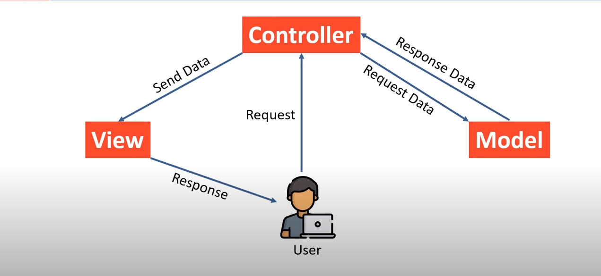
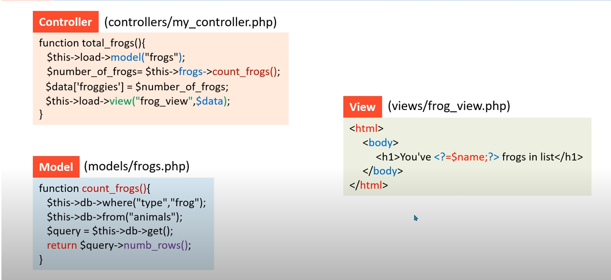
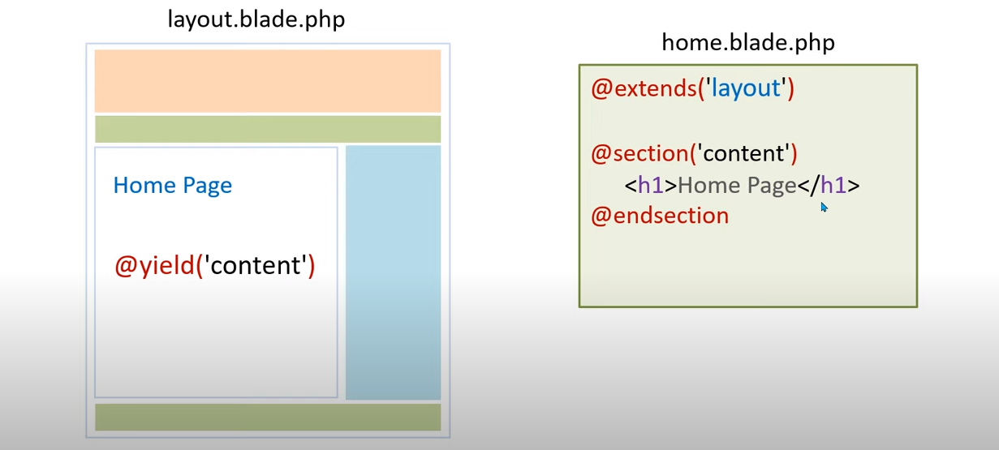
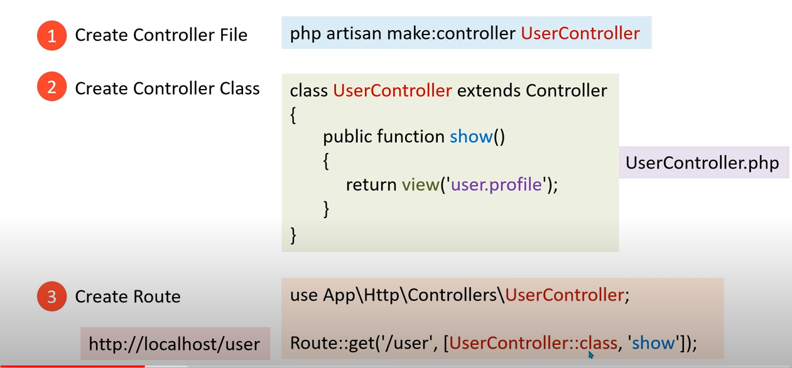
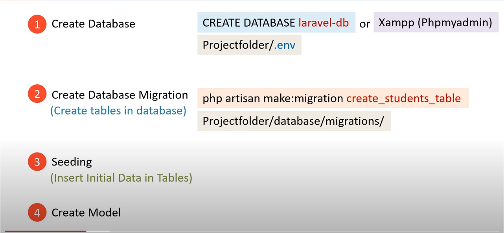
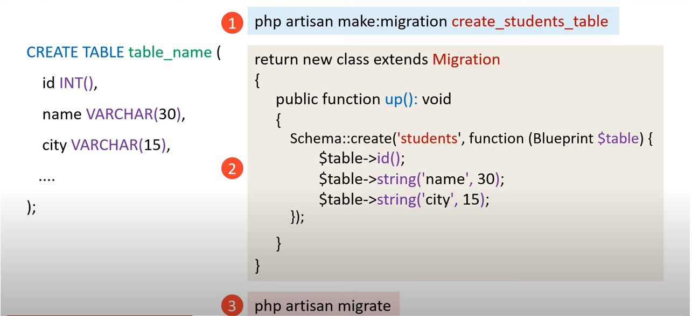

# [Youtube video](https://www.youtube.com/watch?v=M9DoUszVCFc&list=PL0b6OzIxLPbz7JK_YYrRJ1KxlGG4diZHJ)
# [You Make](https://invoices.hirewebxperts.com/pms/)

# Q1. What is Laravel 
### Ans = Laravel is a free, open-source PHP web framework, created by Taylor Otwell and intended for the development of web applications following the model–view–controller  (MVC) architectural pattern

# Q2 What is MVC Pattern
### Ans = MVC stands for Model View Controller and it's a design pattern that helps to separate the code into three parts: model, view & controller. The main 
### 1. Model -> Database (Sql Queries)
### 2. View  -> User Interface (Html)
### 3. Controller -> Business logic (Mediator Between Modal and View)

# Q3 MVC pattern Work flow

# Q4 How to code in MVC Framework


# Q5 Benefit of MVC Framework
### 1. Organized Code
### 2. Independent Block
### 3. Reduce the complexity of Web Application
### 4. Easy to Maintains
### 5. Easy to Modify
### 6. Code reusability

# 1. Download Composer and instal
### [Composer Link](https://getcomposer.org/download/)
### click on Composer-Setup.exe 
### Select Developer mode
### select path to install
### select path of php eg:- D:\wamp64\bin\php\php8.2.0
### And Click on Next btn and install
### open command prompt
```
composer 
```

# 2. Build a project 
## there are two types build a project
# 1. Global Installation
```
composer global require laravel/installer
 laravel new [app-name]
 ```
# 2. Per Prioject Intallation
```
 composer create-project laravel/laravel [app-name]
 ```
## For more inforemation [laravel.com](https://laravel.com/docs/10.x/installation#your-first-laravel-project)
  

# 3. Start a project
```
cd [app-name]
php artisan serve
```

# 4. Vs Code Extension
### 1. PHP IntelliSense (Damjan Cvetko)
### 2. PHP Namespace Resolver (Mehedi Hassan)
### 3. Laravel Extra Intellisense (amir)
### 4. laravel-blade (Christian Howe)
### 5. Laravel Blade Snippets (Winnie Lin)
### 6. Laravel Snippets (Winnie Lin)
### 7. Laravel goto view (codingyu)
### 8. Laravel Goto (Adrian)
### 9. Laravel Artisan (Ryan Naddy)

# 5. Laravel Folder & File Structure
### 1. Moadel Folder
### -> Path => app/Models
### -> Darabase / SQL Queries Handing Files

### 2. Controller Folder
### -> Path => App/Http/Controllers
### -> Business Logics Files

### 3. View Folder
### -> Path => resources/views
### -> Html Files


### 4. Routing Folder
### -> Path => routes folder
### -> URL Defining Files

### 5. Assests Folder?
### -> Path => public/assestes
### -> CSS, JS and Images files 

### 6. Configrations
### -> config/database.php
### -> Configure your Project

## 6 Laravel Routes
## file path => routes/web.php

## Return only two File path

## 1. Without Parameters

```
Route::get('/', function () {
    return view('welcome');  
});

```
or
```
Route::view('/', 'welcome');  
```

### view('');  
- view() => view Folder Path  => resources/views 
- 'welcome' =>  File name  => resources/views/welcome.blade.php

## 2. With Parameters

```
Route::get('/demo/{id}', function (string $id) {
    return 'User '.$id;
});

```
## how to check if Paramter  is null

```
Route::get('/demo/{id?}', function (string $id = null) {
    if ($id) {
        return 'User '.$id;
    } else {
        return 'User ';
    }
    
});
```

## Laravel Route Constraints

### 127.0.0.1:8000/demo/10   =============>  whereNumber('id')
### 127.0.0.1:8000/demo/asdf   =============>  whereAlpha('name')
### 127.0.0.1:8000/demo/asd12   =============>  whereAlphaNumeric('name')
### 127.0.0.1:8000/demo/song   =============>  whereIn('category',['movie','song'])
### 127.0.0.1:8000/demo/@123   =============>  where('id',[@0-9]+)

### eg =>
```
Route::get('/demo/{id?}', function (string $id = null) {
    if ($id) {
        return 'User '.$id;
    } else {
        return 'User ';
    }
    
})->whereNumber('id')
```

### view('');  
- view() => view Folder Path  => resources/views 
- 'welcome' =>  File name  => resources/views/welcome.blade.php

## 7. Commands

### list all commands
```
php artisan
```

### list all Routes
```
php artisan route:list
```
### Remove package Routes
```
php artisan route:list --except-vendor
```
### Find Route
```
php artisan route:list --path=[name]
```

## 8. Laravel Named Routes
```
Route::get('/pages/about-us', function () {
    return view('welcome');  
})->name('about')
```

```
<a href={{ route('about') }}>About</a>
```

## 9. Redirect func in Routes
```
Route::redirect('/test','/about', 301)
```
### 1 parameter of user given
### 2 parameter of redirect a user
### 3 parameter of redirect [codes](https://en.wikipedia.org/wiki/URL_redirection)

## Laravel Route Groups
```
Route::get('/pages/services', function () {});
Route::get('/pages/about', function () {});
Route::get('/pages/login', function () {});
```
Change to 
```
Route::group(['prefix'=>'pages'],function(){
    Route::get('/services', function () {});
    Route::get('/about', function () {});
    Route::get('/login', function () {});
});
```

## 10. php to Blade Template

# Print Hello

## php
```
<?php
 echo "hello";                                                     
?>
```
### Blade template      
```
{{ "hello" }}
```

# add Variable

## php
```
<?php
 echo $name;                                                     
?>
```
### Blade template      
```
{{ $name }}
```

# Render a html

## php
```
<?php
 echo "<h1>Hello</h1>";                                                   
?>
```
### Blade template      
```
{!! "<h1>Hello</h1>"!!}
```
### Blade template      
```
{!! "<script>console.log("hello")</script>"!!}
```

# Boiler plate
## php
```
<?php
                                                 
?>
```
### Blade template      
```
@php

@endphp
```

# Comment

## php
```
<?php
    // comment                                        
?>
```
### Blade template      
```
{--comment--}
```
# if else

## php    
```
<?php
if (condition) {
    # code...
}elseif (condition) {
    # code...
}
else {
    # code...
}
?>

```

## php
```
@if (condition)
    # code...
@elseif (condition)
    # code...
@else
    # code...
@endif
```
# Switch Case

## php    
```
switch ($variable) {
    case 'value':
        # code...
        break;
    
    default:
        # code...
        break;
}
```

## php
```
@switch($variable)
    @case('value')
        # code...
        @break
    @default
@endswitch
```
# if isset

## php    
```
if (isset($var)) {
    # code...
}
```

## php
```
@isset($var)
    #code ...
@endisset
```

# if empty

## php    
```
if (empty($var)) {
    # code...
}
```

## php
```
@empty($var)
    #code ...
@endempty
```


# Loops

```
@for ($i=0; $i < ; $i++)
    the value is {{$i}}
@endfor
```

```
@foreach ($variable as $key => $value) 
    this is {{$key}} and value {{$value}}
@endforeach
```

```
@While(condition)
    #code ...
@endwhile
```

```
@forelse($users as $user)
    <li>{{$users->name}}</li>
@empty
    <p>No users</p>
$endforelse
```

```
@continue
@break
```

# Loops Func


### eg :) 

```
<ul>
@foreach($names as $name)
    <li>{{$loop->index}} -  {{ $n }}</li>
@endforeach
</ul>
```

# Blade Template Main Directives

## file exist in folder
### 1. @inclue
```
@include("header")
```
### - header => file Name

## file is not exist in folder

```
@include("pages.header")
```
### - pages => folder Name
### - header => file Name

## parse  a parameters

```
@include("pages.header", ['name', => "Atul"])
```

## how to get parameters
```
{{$name}}
```

## how to check if file exist
```
@includeif("pages.header")
```

## how to add conditions in include

```
@includeWhen(Condition value,'viewfile',['status' => 'Hello'])
```

eg )

```
@includeWhen(true,'pages/header')
```

### the file is include
```
@includeWhen(false,'pages/header')
```

### the file is not include

### Opposite

```
@includeUnless(Condition value,'viewfile',['status' => 'Hello'])
```

eg )

```
@includeUnless(true,'pages/header')
```

### the file is not include
```
@includeUnless(false,'pages/header')
```

### the file is include

## - Condition value => true/fale

### 2. @section
### 3. @yield
### 4. @extend



### - @yield('content')    =>   dynamic page
### - @extend('layout')    =>   get layout page

```
@section('content')
<h1>This is content</h1>
@endsection
```

### how to set Default value of yields
```
@yield('content', 'Default Value')
    @yield('content', )
@else
    <h2>No Content Found</h2>
@endif
```

OR

```
@hasSection('content')
```

## How to append data in layout

### Add Section
```
@section('sidebar')
    #code ...
@show
```

### Append data
```
@section('sidebar')
    @parent
    you want add
@endsection
```

### how to absolute path 
```
{{asset('folder/file.txt')}}
```
### - asset func show file in public folder

### @section add to dynamic content


## Php variables in Javascript
```
<script>
    var data = @json($data);
</script>
```
Or
```
<script>
    var data = {{ Js::from($fruits) }};
</script>
```

## Js in Template Inheritence
```
@stack('script')
```
add
```
@push('script')
    <script src="srcript.js"></script>
@endpush
```
### This help for special file add css, js and other files

## if stack before add css, js
```blade
@prepend('style')
    #add css, js and if use internal pls add with tags
@endprepend
```

## Add Dynamic Js Values
```js
var  name = 'Atul';
```
<!-- ### get value in blade php (vue js)

```
@verbatim
{{ name }}
@endverbatim
``` -->


## Route to View Data transfer


```js
Route::get('/user', function () {
    return view('user', [
        'user' => "Atul",
        'city' => "Ambala"
        ]);
});
```

Or

```js
Route::get('/user', function () {
    return view('user')->with('user', "Atul")->with('city', "Ambala")
});
```

Or

```js
Route::get('/user', function () {
    return view('user')->withUser("Atul")->withCity("Ambala")
});
```
 
# Controler



## Group of Controles 
PageController.php
```
class PageController extends Controller
{
    public function showHome(){
        return view('welcome');
    }
    public function showUser(){
        return view('user', compact('id'));
    }
}
```
users.blade.php
```
Route::controller(PageController::class)->group( function (){
    Route::get('/','showHome')->name('home');
    Route::get('/blog','showHome')->name('blog');
    Route::get('/user/{id}','showUser')->name('users');
})
```

### compact() func is used for if key and value is same name.

## If Class By Default Run Function


### Add Route line
```
use app\Http\Controllers\TestingContoller
```

# Modal



## 1. file path of Database
### Path => conf/database.php  

## Migeation 


## if table create with Schema
```
php artisan make:migration create_demo_table
```
## if table create without Schema
```
php artisan make:migration demo
```

## if Migration status check
```
php artisan migration:status
```

## if Migration not update
```
php artisan migration --force
```

## if Migration undo
```
php artisan migration:rollback
```

### how many step back in migration
```
php artisan migration:rollback -step=3
```
you back to 3 step back in migration


### You particular number back in migration
```
php artisan migration:rollback -batch=2
```
you back to 2 migration

### You delete all database
```
php artisan migration:reset
```


### if Table Create 
```
php artisan migration
```


### if Table Drop
```
php artisan migrate:fresh
```
### if Table Drop and Recreate
```
php artisan migrate:refresh
```

## Create Model
```
php artisan make:model Users -m
```
- -m Used for create migration of same name

## Modification in Migrtion 


## Add Column in table
